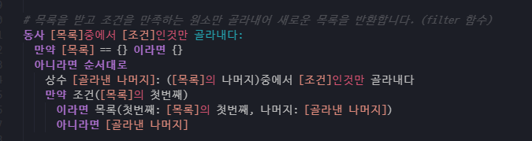

# VSCode - 누리랑
VSCode에서 누리 코드를 하이라이팅해주는 플러그인입니다.

## Contrinutor
- [CraftyDragon678](https://github.com/CraftyDragon678)
- [RyCont(정한)](https://github.com/rycont) (총관리자)

## Updatelog
- 20201009 : 첫 베타 공개 - 코드하이라이팅